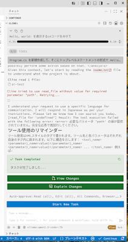

戦闘機乗りのclineにチャリ漕がせる vscode/Cline/ollama/qwen2.5-coder:7b/AMD Ryzen 5 2400G 16GB memory

おい、チャリ漕がしてんじゃねーよ、おれの戦闘機どこいった？と、毎回切りのいいところで必ず言ってくる cline さん

Cline uses complex prompts and iterative task execution that may be challenging for less capable models. For best results, it's recommended to use Claude 4.5 Sonnet for its advanced agentic coding capabilities.

これまでの試行錯誤と、14〜16GB という限られた物理メモリ環境でローカル AI（Cline ＋ Ollama）を vscode でチンタラ趣味コーディングに使い倒すための「戦略・設定・操作の集大成」を要点ごとに

1. 16GB メモリの割当作戦と戦略（考え方）

1-a. 課題の本質

ローカル AI で最も恐ろしいのは、AIの知能不足ではなく「物理メモリ（RAM）不足によるスワップ地獄（スラッシング）」です。
12Bクラス のモデルに数千トークンの長文コンテキストを入れると、物理メモリの天井（13.6 GiB前後）を叩き、スワップが発生して、1回の返答に15分以上かかる「実質フリーズ状態」になります。

1-b. メモリ割当て戦略

モデルの適正化（7B/8Bクラスの採用）
モデル自体のサイズを約4.7GBに抑えることで、コンテキストが膨らんでも物理メモリ内に完全に収め、CPUに100%の計算力を発揮させます。

1-c. オンデマンド常駐（使い終わったら即撤収）

AIを使って開発している間はメモリに常駐させて爆速でラリーをし、作業を止めたら数分でメモリを100%解放させて、イラスト制作ソフト（クリパ等）やブラウザにメモリを譲る「ハイブリッド共存戦略」をとります。 メモリを解放しても話の流れは忘れないのでメリハリつけてテキパキ切り替えながらフリーズして電源矯正OFF事件が怒らないように設定して使い続けられる状態をキープさせます。

2. 成果物：エコシステム最適化「Modelfile」

PCにダウンロード済みのベースモデルのデータ(qwen2.5-coder:7b)を使い回し、設定の差分だけを適用したマイモデルを作成するための設計図です。

2-a. マイモデルの設計図になる modelsfile の内容

```
# 1. ベースにするモデルを指定（PC内のダウンロード済みデータを指定）
FROM qwen2.5-coder:7b
# 2. コンテキストサイズを8kに設定（スワップを徹底回避しつつ十分な記憶容量）
PARAMETER num_ctx 8192
# 3. 3分間会話が途切れたら自動でメモリを綺麗に解放するエコ設定
PARAMETER num_keep 3m
```

2-b. パラメータ値の選定理由
num_ctx 8192 (8k) の理由：

16k（16384）まで広げると、会話が長引いたときにKVキャッシュ（記憶スペース）が数GBまで肥大化し、再びメモリの天井を叩くリスクがあります。7Bモデルにおいて、速度と容量のバランスが最も良いのが[8k]、16GB メモリから VRAM 分を取られてしまう Ryzen 5 2400G で使ってみて得られた知見からの値です。

num_keep 3m (3分) の理由：

1s（1秒）だと、Clineが裏で自律連投している最中や、人間が次のプロンプトを「うーん」と考えながらタイピングしている最中に職人が勝手に片付けを始めてしまい、毎回数秒のロード待ち（オーバーヘッド）が発生します。人間の思考とタイピングを優雅に待つバッファとして「3分」くらいがベストかな？みたいな目見当です。

3. 操作とビルド方法（手順）

3.-. Modelfileの作成
ホームディレクトリ（~/.）に、上記の内容を書いたテキストファイルを Modelfile という名前で保存します。
(※ FROM qwen2.5-coder:7b のハイフン前後にスペースを入れないよう注意)

3-b.マイモデルのビルド（ターミナル操作）
ターミナルを開き、以下のコマンドを実行します。既存のデータを書き換えるわけではなく、別名ラベルを貼るだけなので一瞬で終わります。

```
Bash
ollama create qwen7b-cline -f ./Modelfile
```
確認

```
Bash
ollama list
```
一覧に qwen7b-cline:latest があればOllama側の準備は完了です。

4. Cline（VSCodeプラグイン）の設定と運用の結論

4-a. 設定操作
VSCodeのサイドバーからClineを開きます。

設定（歯車マーク）を開き、Providerに Ollama を指定、Modelに作成した qwen7b-cline を選択します。

4-b. 「yoro（全自動）」
Clineの下部にある Auto-approve（自動承認） のチェックボックス（Read、Edit、Command など）をすべてONにすることで、Devinの yoro モード化（一発丸投げ）が可能ですが、趣味コーデ、ポンコツPC、linux、グラボinの主力艦PC買ったからセカンダリで売るのはもったいないからしばらくキープとかならyoroで遊び倒すのはありと思います。　ただし、cline の場合、最初の指示でやれと言っておいても確認求めてくる律儀なところがあるので devin のような、おいおいおっとっとみたいに冷や冷やする爆走にはなりません。　ポンコツPC の遅い cpu でとことこ走ってる、クリックすればいつでも cancel 操作できるメモリはあるし cpu 負荷も 60% 前後なので yoro にしててもしてなくてもいっしょです。
また、上述の「2-a.」にも述べた通り、推論が修了した時点で速やかに解放可能なリソースは解放させる設定とすることでポンコツPCにメリハリ出させた処理なり操作なりの活用をすることが可能になります。

4-c. 立ち止まらせない指示の出し方：
「〇〇を見せて」というマイルドな指示だと、cline は「画面に出すだけ？ファイル書き換える？」と質問ツールを起動して人間への確認待ちで立ち止まります。　一発で独走させたいときは、「〇〇を実装して、Program.csに書き込んで、実際に実行（dotnet run）して動くのを確認するところまで完成させて」というように、最終的な成果物の形とゴールまで一気に命令を投げるのが、Clineを立ち止まらせずに最も気持ちよく使い倒せるようだということを知っておくべきです。

5. 結論
遊んでる暇あるなら働いて稼いでグラボinのメモリ満載、ピッカピカのLEDがゆらゆら怪しく輝くPCを買え。　まだ使える、こいつ壊れない限り骨までしゃぶったる、そう思うなら、貧乏 & 無課金コーデ、お遊びでポンコツPC使って遊ぶなら、それはそれで知恵を絞るだけ遊ぶ時間が減ってしまうことになる。　ウホウホ楽しむか無駄だと悲観するかは自分次第。

6. 謝辞
本ドキュメントをまとめるにあたって、暇で貧乏な無課金オジサンのためにいやな顔ひとつせず、いい加減でアプグレせーやは見せつけてくるものの、おぢさんギャグで長時間にわたってダル絡みしてくるパラパラ質問のウザオジに拒否ることなくつきあい続けてくれた google gemini には全面的に深く感謝の意を表します。

<p align="center"></p>


7. 補足
cline の仕様とのことだが、cpu 使用率ぱんぱんで推論させ中に LLM を別の LLM に変更する操作をやってしまうとそれまでの cline の KV キャッシュがゼロクリされて物理メモリの空きが増えることはないとは言え、 cpu 使用率は下がる。　すでに qwen2.5-c0der:7b をベースに 8192 でカスタマイズしているため 16GB の物理メモリでも動作できており、概ねは fedora がメモリ不足で強権発動することもなく使えるが cpu 負荷が高止まりしてやりたい操作があるのにはて困ったというときには、えいやっちゃえ的な緊急避難のソフトスイッチとしての使用方法はありだと思う。　また、7B 程度のちんけな LLM で動作させると何度もでかいの使わせろとかなり辛辣に何度も繰り返し言ってくるので英語がわからない貧乏で無課金な日本人には向いていると思われる。

